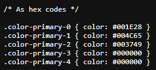

# Entregable colores Diseño de Interfaces Web 
## Autor: FRANCISCO GARCIA GUERRERO 
### Justificación: 
Para comenzar, he elegido una paleta de colores azules oscuros y negro para los fondos y para el principal color de la página  .

Para el resto de tipografía voy a escoger el blanco.
 #ffffff

Y para ensaltar algunas partes de la página voy a usar el rojo y el verde, en concreto:

Rojo: #c80037

Verde: #3bb552
